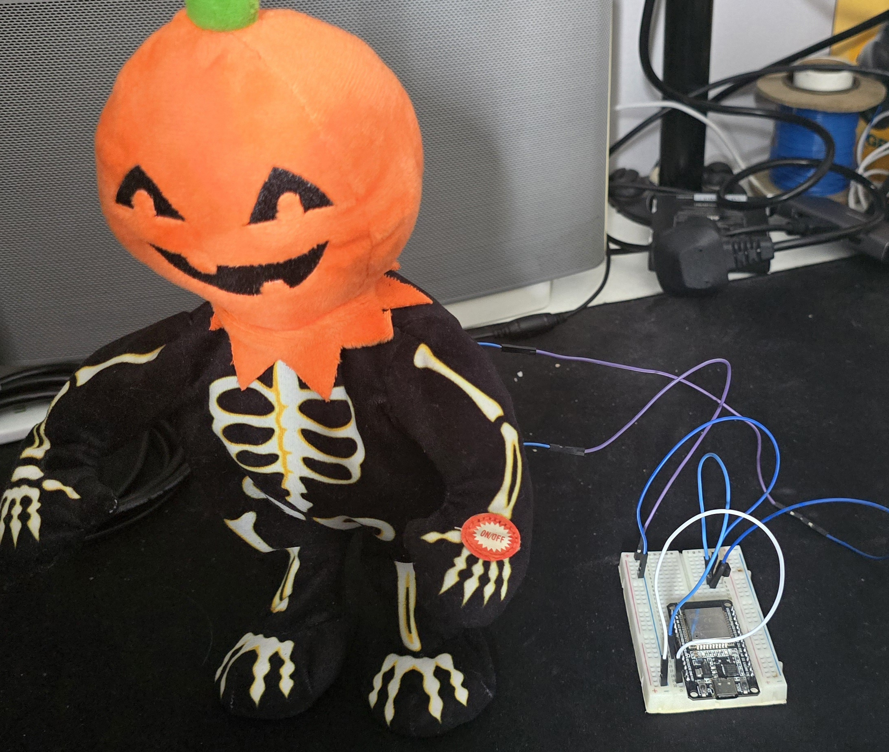

# ESP32-Webserver-Repeating-Pin
A web server that runs on an ESP32 that on calling an endpoint can toggle a pin or with configured delay and repeat

## Endpoints
### /toggle
This is a POST endpoint, used for toggling the pin on a one off basis, in the default state pin 26 what gets toggled. Read more about what I am using this for [here](#my-purpose)

There is no response body with this request, a status code of [202](http://http.cat/202) ([accepted](https://developer.mozilla.org/en-US/docs/Web/HTTP/Status/202))

### /config
This is a POST/PATCH/PUT endpoint, used for configuring the repeat and repeat delay. 
All body components are optional and if they're not present will leave the config as is.

#### Body
```json
{
	"restartOutput": false,
	"restartDelay": 2000,
	"completeSong": true
}
```

#### Response Body
Using the [example](#body) this is the response body from the server.
```json
{
	"restart": false,
	"delay": 2000,
	"activeLength": 47500,
	"totalDelay": 49500,
	"status": "OK"
}
```

#### Example
If I made a request using the body in the [example](#body) then made another request using the body below, restartOutput would stay false, but restart delay would be 3000/50500 (delay/total delay)

```json
{
	"restartDelay": 3000,
}
```

## How to use
1. Clone the repository
2. Add the VS Code extension [PlatformIO](https://platformio.org/install/ide?install=vscode)
3. Create a secrets.h file using the included secrets.h.template in the include directory.
4. Update the secrets.h file with your WiFi credentials and other config.
5. In VS Code go to the platformIO tab on the left bar, find the development profile and click Upload and Monitor
6. Done! Connect to the correct network and use a tool like [Insomnia](https://insomnia.rest/) or [Postman](https://www.postman.com/) or the curl scripts below to use the endpoints above, described [here](#endpoints). The IP for the Esp32 will be outputted in the serial monitor after the upload is complete or use the hostname `ESP32-SERVER`, when using the ESP32 in AP (Access Point) mode the IP will be `192.168.4.1`.

```bash
curl --request POST --url http://ESP32-SERVER/toggle

curl --request POST \
  --url http://ESP32-SERVER/config \
  --header 'Content-Type: application/json' \
  --data '{
	"restartOutput": false,
	"restartDelay": 2000,
	"completeSong": true
}'
```

## My Purpose
I am using this web server to run an 'annoying machine', the 'machine' is an [animatronic dancing halloween themed skeleton with a pumpkin head](https://www.biglots.com/product/13-25-dancing-pumpkin-skeleton-animated-plush/p810523695) that was acquired from a classmate at UTC Reading that I have pulled apart and added an extra 2 wires to the button circuit then reassembled. I have then wired this into the ESP32 through a transistor controlled by pin 26 to join the wires together effectively replacing the button.




## Future Plans
I don't have many future plans for this yet, but if any do appear or I notice any issues I will be documenting that in the [GitHub Issues tab](https://github.com/Bubcool1/ESP32-Webserver-Repeating-Pin/issues).